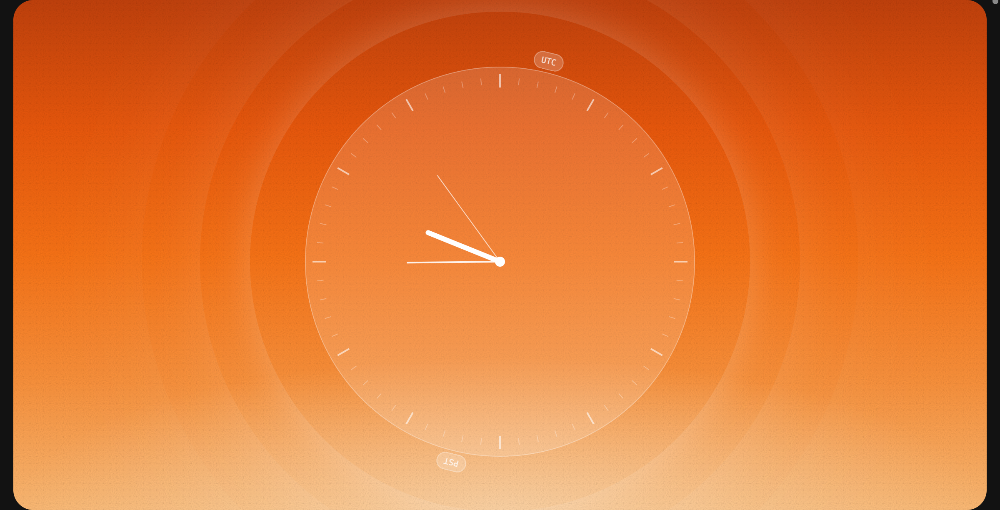

# @gobrand/tiempo

[](https://www.npmjs.com/package/@gobrand/tiempo)
[](https://github.com/go-brand/tiempo/actions/workflows/ci.yml)
[](https://opensource.org/licenses/MIT)



**Timezone conversions that don't suck.** Built on the [Temporal API](https://tc39.es/proposal-temporal/docs/).

👉 **[Documentation](https://eng.gobrand.app/tiempo)**

- **Zero timezone bugs** - Real IANA timezone support, not UTC offset hacks
- **DST-aware math** - `addDays(1)` means tomorrow, even across clock changes
- **Nanosecond precision** - When milliseconds aren't enough
- **Type-safe** - Full TypeScript, catches datetime errors at compile time
- **Familiar API** - If you've used date-fns, you already know this

```typescript
import { toZonedTime, addDays, format, toUtcString } from '@gobrand/tiempo';

// Backend sends UTC
const utc = "2025-03-09T07:00:00Z";

// Convert to user's timezone, manipulate, format
const userTime = toZonedTime(utc, "America/New_York");
const tomorrow = addDays(userTime, 1);  // DST transition handled correctly
const display = format(tomorrow, "EEEE 'at' h:mm a");  // "Monday at 2:00 AM"

// Send back to backend as UTC
const payload = toUtcString(tomorrow);  // "2025-03-10T06:00:00Z"
```

## Install

```bash
npm install @gobrand/tiempo
```

## Docs

**[eng.gobrand.app/tiempo](https://eng.gobrand.app/tiempo)** — Full API reference, examples, and guides.

## License

MIT © [Ruben Costa](https://x.com/PonziChad) / [Go Brand](https://gobrand.app)
